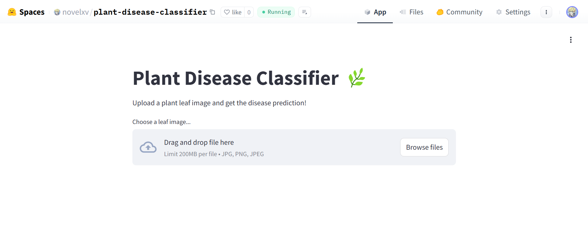
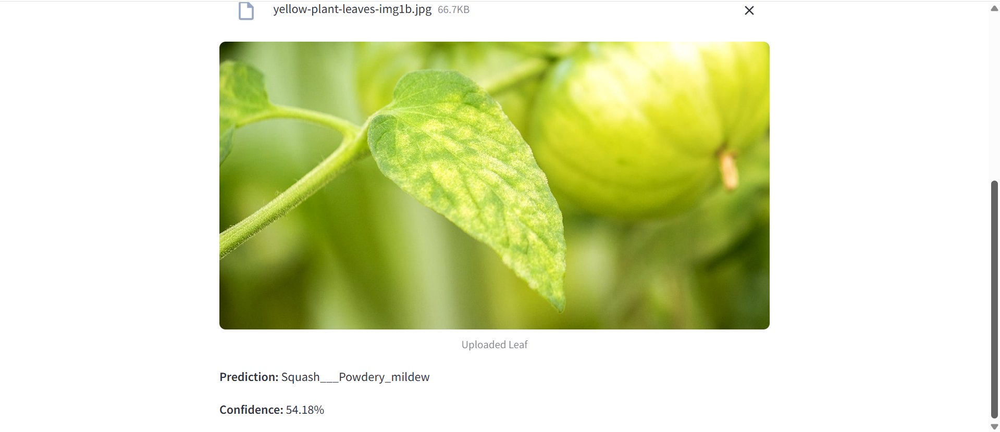

# 🌿 Plant Disease Classifier

A deep learning web application to detect plant diseases from leaf images.  
Built using TensorFlow (MobileNetV2), Streamlit, and deployed to Hugging Face Spaces.

---

## 🚀 Live Demo

Try it here:  
👉 [Plant Disease Classifier on Hugging Face Spaces](https://huggingface.co/spaces/novelxv/plant-disease-classifier)

---

## ✨ Features

- **Upload** any leaf photo and instantly get disease prediction and confidence score.
- **Supports 38 classes** of plants/diseases from the PlantVillage dataset.
- Fast, lightweight, and works directly in your browser.

---

## 📝 How It Works

1. **Preprocessing:**  
   Images are resized (128x128), normalized, and split into train/validation/test sets.

2. **Model Training:**  
   - Transfer learning with MobileNetV2 (pre-trained on ImageNet).
   - Fine-tuned on PlantVillage dataset for multi-class classification.

3. **Web App:**  
   - Built with Streamlit.
   - Users upload a photo → model predicts disease class and confidence.

4. **Deployment:**  
   - Deployed on Hugging Face Spaces for easy public access.

---

## 📊 Results

- **Test Accuracy:**  
  (insert your result, e.g. `~97%`)
- **Best Model:**  
  Selected using validation accuracy with early stopping.

- **Confusion Matrix & Example Predictions:**  
  See screenshots below!

---

## 🖼️ Screenshots

---

## 📦 Dataset

- [PlantVillage Dataset on Kaggle](https://www.kaggle.com/emmarex/plantdisease)

---

## 💡 Future Improvements

- Add leaf segmentation for better accuracy.
- Highlight (heatmap) area of disease (explainable AI).
- Mobile app integration for real-time farm usage.
- Expand to more plant species and real-world images.

---

## 🙋‍♂️ Author

Novelya Putri Ramadhani
- HuggingFace: [novelxv](https://huggingface.co/novelxv)
- GitHub: [novelxv](https://github.com/novelxv)

---